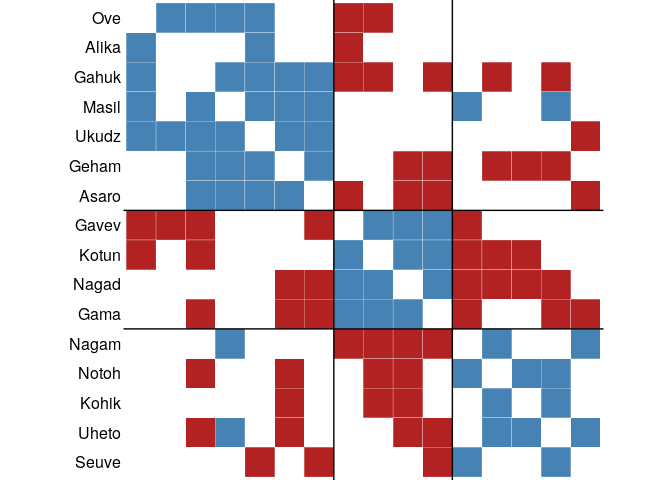
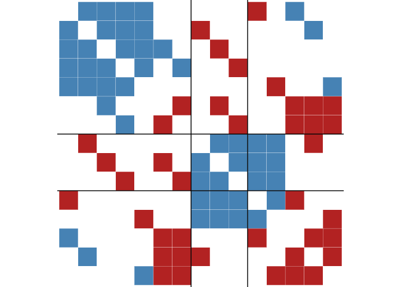

<!-- README.md is generated from README.Rmd. Please edit that file -->

# signnet 

<!-- badges: start -->

[](https://travis-ci.org/schochastics/signnet)
[](https://cran.r-project.org/package=signnet)
[](https://www.tidyverse.org/lifecycle/#maturing)
[](https://CRAN.R-project.org/package=signnet)
[](https://codecov.io/gh/schochastics/signnet?branch=master)
<!-- badges: end -->

The package provides methods to analyse signed networks (i.e. networks
with both positive and negative
ties).

## Installation

<!-- You can install the released version of signnet from [CRAN](https://CRAN.R-project.org) with: -->

<!-- ``` r -->

<!-- install.packages("signnet") -->

<!-- ``` -->

You can install the development version from Github with:

``` r
# install.packages("devtools")
devtools::install_github("schochastics/signnet")
```

## Structural Balance

The principles underlying structural balance are based on a theory in
social psychology dating back to the work of Heider in the 1940s, which
was generalized and extended to graphs by Cartwright and Harary in the
1950s. In its simplest form, it is defined via triangles. A triangle is
balanced if all ties are positive (“the friend of a friend is a friend”)
or only one tie is positive (“the enemy of my enemy is my friend”). The
remaining configurations are said to be unbalanced.


A network is balanced if i.a., it can be partitioned into two vertex
subsets, such that intra-group edges are all positive and inter-group
edges are all negative. Determining this is easy, but measuring a
*degree of balancedness* (i.e. how close is a network to be balanced?)
is not. The package, so far, implements three methods to calculate
balance scores. All are defined such that a value of one indicates
perfect balance and zero perfect unbalance. Though for intermediate
networks, results may vary significantly. Check [this
paper](https://doi.org/10.1093/comnet/cnx044) by Samin Aref (and his
other work) for more details.

``` r
library(igraph)
library(signnet)
data("tribes")

balance_score(tribes,method = "triangles")
#> [1] 0.8676471
balance_score(tribes,method = "walk")
#> [1] 0.3575761
balance_score(tribes,method = "frustration")
#> [1] 0.7586207
```

# Blockmodeling

The package implements two different blockmodeling algorithms. The
classic one tries to partition the network into a specified set of
groups such that intra group edges are positive and inter group edges
are negative.

``` r
clu <- signed_blockmodel(tribes,k = 3,alpha = 0.5,annealing = TRUE)
clu
#> $membership
#>  [1] 1 1 3 2 2 3 3 3 2 2 3 3 2 2 1 1
#> 
#> $criterion
#> [1] 2
```

The parameter *k* is the number of groups and *alpha* specifies the
penalty of negative inter group and positive intra group edges. If
`alpha = 0` (`alpha = 1`) then only positive inter group (negative intra
group) edges are penalized. Set `alpha = 0.5` for equal penalization The
algorithm is not exact and just a heuristic. If `annealing = TRUE`, then
simulated annealing is used. This improves the result, but may take
additional time.

The result of the blockmodel can be visualized with `ggblock` (requires
`ggplot2`)

``` r
ggblock(tribes,clu$membership,show_blocks = TRUE,show_labels = TRUE)
```



The second blockmodeling technique is known as *generalized
blockmodeling*. This method removes the restriction of positve
(negative) inter (intra) group edges. Instead, a blockmatrix is passed
to the function with the desired block structure. The example below
illustrates the technique with a network composed of three groups with
differing inter/intra group edge
patterns.

``` r
# create a signed network with three groups and different inter/intra group ties
g1 <- g2 <- g3 <- graph.full(5)

V(g1)$name <- as.character(1:5)
V(g2)$name <- as.character(6:10)
V(g3)$name <- as.character(11:15)

g <- Reduce("%u%",list(g1,g2,g3))
E(g)$sign <- 1
E(g)$sign[1:10] <- -1
g <- add.edges(g,c(rbind(1:5,6:10)),attr = list(sign=-1))
g <- add.edges(g,c(rbind(1:5,11:15)),attr = list(sign=-1))
g <- add.edges(g,c(rbind(11:15,6:10)),attr = list(sign=1))

# specify the link patterns between groups
blockmat <- matrix(c(1,-1,-1,-1,1,1,-1,1,-1),3,3,byrow = TRUE)
blockmat
#>      [,1] [,2] [,3]
#> [1,]    1   -1   -1
#> [2,]   -1    1    1
#> [3,]   -1    1   -1

clu <- signed_blockmodel_general(g,blockmat,0.5)
clu
#> $membership
#>  [1] 2 2 3 2 2 2 2 2 3 2 3 3 3 1 3
#> 
#> $criterion
#> [1] 0
ggblock(g,clu$membership,show_blocks = TRUE,show_labels = FALSE)
```


