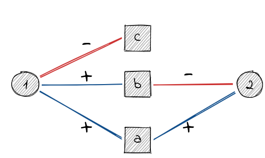

# Signed Two-Mode Networks

This vignette describes methods implemented to analyze signed two-mode
networks.

``` r
library(igraph)
library(signnet)
```

## Projections

A common analytic tool for two-mode networks is to project the network
onto on relevant mode. This is easily done using the adjacency matrix
$A$. $AA^{T}$ yields the row projection and $A^{T}A$ the column
projection. The resulting networks will thus be weighted. Several
methods exist to turn a weighted projection into an unweighted network
where only the most significant edges are included. A number of these
methods are implemented in the
[backbone](https://cran.r-project.org/package=backbone) package.

Projecting signed networks, however, is not as straightforward. Consider
the following simple example.

``` r
el <- matrix(c(1,"a",1,"b",1,"c",2,"a",2,"b"),ncol = 2,byrow = TRUE)
g <- graph_from_edgelist(el,directed = FALSE)
E(g)$sign <- c(1,1,-1,1,-1)
V(g)$type <- c(FALSE,TRUE,TRUE,TRUE,FALSE)
```



If we use the regular projection rules we obtain

``` r
A <- as_incidence_signed(g)
R <- A%*%t(A)
C <- t(A)%*%A
R
#>   1 2
#> 1 3 0
#> 2 0 2
C
#>    a  b  c
#> a  2  0 -1
#> b  0  2 -1
#> c -1 -1  1
```

The row projection suggests that there is no relation between 1 and 2,
when in fact there is a negative path (via b) and a positive path (via
a) between them. The same holds for the column projection and the nodes
a and b.

The paper of Schoch introduces two projection methods that circumvent
this “nullification”. The package implements the *duplication* approach
since it plays well with existing binarization tools. The first stepp is
to turn the signed two-mode network into an unsigned one. This is done
by duplicating all vertices of the primary mode (i.e. the one to project
on). For example, vertex a turns into two vertices “a-pos” and “a-neg”.
The vertices of the secondary mode connect to these new vertices
depending on the sign of edge. For instance, 1 has a positive edge to a
and thus 1 connects to a-pos.

This can be done for the whole network with the function
[`as_unsigned_2mode()`](https://schochastics.github.io/signnet/reference/as_unsigned_2mode.md)
by specifying the primary mode (either TRUE or FALSE).

``` r
gu <- as_unsigned_2mode(g,primary = TRUE)
gu
#> IGRAPH 07189ec UN-B 8 5 -- 
#> + attr: name (v/c), type (v/l)
#> + edges from 07189ec (vertex names):
#> [1] a-pos--1 b-pos--1 c-neg--1 a-pos--2 b-neg--2
```

Now, any binarization toll (e.g. from the `backbone` package) can be
applied since the network is an unsigned two-mode network. For
illustration, we include all edges with a weight greater one (the
“universal” approach) since it can be done without the `backbone`
package.

``` r
pu <- bipartite_projection(gu,which = "true")
pu <- delete_edge_attr(pu,"weight")
pu
#> IGRAPH 2990682 UN-- 6 4 -- 
#> + attr: name (v/c)
#> + edges from 2990682 (vertex names):
#> [1] a-pos--b-pos a-pos--c-neg a-pos--b-neg b-pos--c-neg
```

After binarization, the network is turned back to an unsigned network
using a *contraction rule*. The contraction rule works as follows.

If there is an edge (a-pos,b-pos) or (a-neg,b-neg) in the projection
then there is a positive edge (a,b) in the signed projection.

If there is an edge (a-pos,b-neg) or (a-neg,b-pos) in the projection
then there is a negative edge (a,b) in the signed projection.

If there is an edge (a-pos,b-pos) **and** (a-neg,b-pos) (or, e.g.,
(a-neg,b-neg) **and** (a-pos,b-neg)) in the projection then there is an
*ambivalent edge* (a,b) in the signed projection.

This is done with the function
[`as_signed_proj()`](https://schochastics.github.io/signnet/reference/as_signed_proj.md).

``` r
ps <- as_signed_proj(pu)
as_data_frame(ps,"edges")
#>   from to type
#> 1    a  b    A
#> 2    a  c    N
#> 3    b  c    N
```

The projection of a signed two-mode network thus may contain three types
of edges (positive (“P”), negative (“N”) or ambivalent (“A”)). The
concept of ambivalent ties comes from work by Abelson & Rosenberg and
Cartwright & Harary.

More technical details can be found in the original paper by Schoch.
Consult the vignette about [complex
matrices](https://schochastics.github.io/signnet/articles/complex_matrices.md)
to learn about analyzing signed networks with ambivalent ties.

## References

Doreian, Patrick, Paulette Lloyd, and Andrej Mrvar. 2013. “Partitioning
Large Signed Two-Mode Networks: Problems and Prospects.” Social
Networks, Special Issue on Advances in Two-mode Social Networks, 35 (2):
178–203.

Schoch, David. 2020. “Projecting Signed Two-Mode Networks” Mathematical
Sociology, forthcoming

Abelson, Robert P., and Milton J. Rosenberg. 1958. “Symbolic
Psycho-Logic: A Model of Attitudinal Cognition.” Behavioral Science 3
(1): 1–13.

Cartwright, Dorwin, and Frank Harary. 1970. “Ambivalence and
Indifference in Generalizations of Structural Balance.” Behavioral
Science 15 (6).
