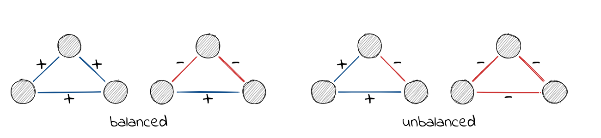

# Structural Balance

This vignette describes structural balance theory and implemented
functions in `signnet` associated with it.

``` r
library(igraph)
library(signnet)
```

## Structural Balance

The principles underlying structural balance are based on a theory in
social psychology dating back to the work of Heider in the 1940s, which
was generalized and extended to graphs by Cartwright and Harary in the
1950s. In its simplest form, it is defined via triangles. A triangle is
balanced if all ties are positive (“the friend of a friend is a friend”)
or only one tie is positive (“the enemy of my enemy is my friend”). The
remaining configurations are said to be unbalanced.



A network is balanced if i.a., it can be partitioned into two vertex
subsets, such that intra-group edges are all positive and inter-group
edges are all negative.

A (random) balanced network can be obtained with the function
[`sample_islands_signed()`](https://schochastics.github.io/signnet/reference/sample_islands_signed.md)
which is pretty much the same as
[`sample_islands()`](https://r.igraph.org/reference/sample_islands.html)
from the `igraph` package.

``` r
g <- sample_islands_signed(islands.n = 2,islands.size = 10,
                           islands.pin = 0.8,n.inter = 5)
```

(The function
[`ggsigned()`](https://schochastics.github.io/signnet/reference/ggsigned.md)
can be used to visualize signed networks. Note that this requires the
package `ggraph` to be installed.) Increasing `islands.n` leads to
“clusterable” networks as defined by Davis.

A balanced network only contains balanced triangles. This can be
verified with
[`count_signed_triangles()`](https://schochastics.github.io/signnet/reference/count_signed_triangles.md).

``` r
count_signed_triangles(g)
#> +++ ++- +-- --- 
#> 160   0   7   0
```

Note the absence of `++-` and `---` triangles.

To list all triangles use
[`signed_triangles()`](https://schochastics.github.io/signnet/reference/signed_triangles.md).

``` r
head(signed_triangles(g))
#>      V1 V2 V3 P
#> [1,] 11  2  3 1
#> [2,] 11  2  5 1
#> [3,] 11  5  3 1
#> [4,] 11 10  2 1
#> [5,] 11 10  3 1
#> [6,] 11 10  5 1
```

The column P indicated the number of positive ties in the triangle. A
value of 3 indicates that the triangle is “+++”.

## Balancedness

Determining if a network is balanced or not is easy, but measuring a
degree of balancedness (i.e. how close is a network to be balanced?) is
not. The package, so far, implements three methods to calculate balance
scores. All are defined such that a value of one indicates perfect
balance and zero perfect unbalance. Though for intermediate networks,
results may vary significantly. Check the paper by Samin Aref (and his
other work) for more details.

``` r
balance_score(g, method = "triangles")
#> [1] 1
balance_score(g, method = "walk")
#> [1] 1
balance_score(g, method = "frustration")
#> [1] 0.816092
```

“triangles” returns the fraction of balanced triangles.

“walk” is based on eigenvalues of the signed and underlying unsigned
network. Check the paper by Estrada for details.

“frustration” assumes that the network can be partitioned into two
groups, where intra group edges are positive and inter group edges are
negative. The index is defined as the sum of intra group negative and
inter group positive edges. Note that the problem is NP complete and
only an upper bound is returned (based on simulated annealing). The
function
[`frustration_exact()`](https://schochastics.github.io/signnet/reference/frustration_exact.md)
implements an integer program to solve the exact optimization problem.
More details can be found in the work of Aref.

There disagreement for non-balanced networks can be seen with the
included “tribes” dataset.

``` r
data("tribes")
balance_score(tribes, method = "triangles")
#> [1] 0.8676471
balance_score(tribes, method = "walk")
#> [1] 0.3575761
balance_score(tribes, method = "frustration")
#> [1] 0.7586207
```

## References

Heider, Fritz. 1946. “Attitudes and Cognitive Organization.” The Journal
of Psychology 21 (1): 107–12.

Cartwright, Dorwin, and Frank Harary. 1956. “Structural Balance: A
Generalization of Heider’s Theory.” Psychological Review 63 (5): 277.

Davis, James A. 1967. “Clustering and Structural Balance in Graphs.”
Human Relations 20 (2): 181–87.

Aref, Samin, and Mark C. Wilson. 2018. “Measuring Partial Balance in
Signed Networks.” Journal of Complex Networks 6 (4): 566–95.

Estrada, Ernesto. 2019. “Rethinking Structural Balance in Signed Social
Networks.” Discrete Applied Mathematics
