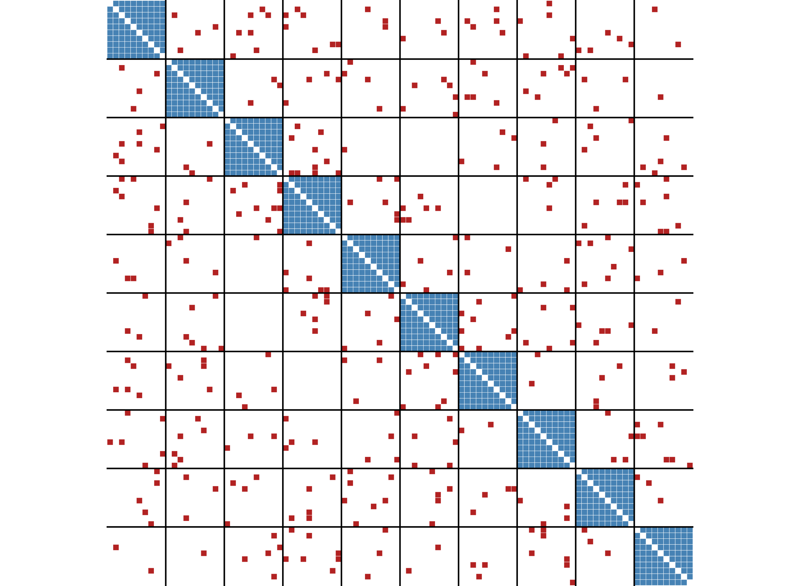
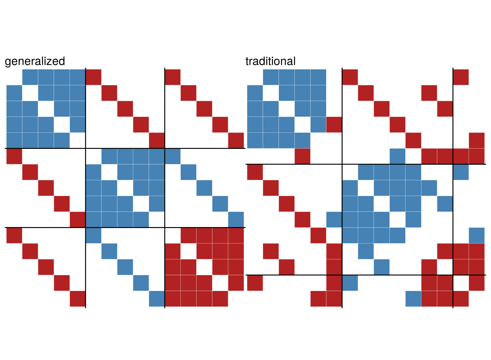

```{r, include = FALSE}
knitr::opts_chunk$set(
  collapse = TRUE,
  comment = "#>",
  message=FALSE,
  warning=FALSE
)
```

This vignette describes the two implemented methods for blockmodeling in signed networks.

```{r setup}
library(igraph)
library(signnet)
```

## Traditional Blockmodeling 

In signed blockmodeling, the goal is to determine `k` blocks of nodes such that all intra-block edges
are positive and inter-block edges are negative. In the example below, we construct a network with a perfect 
block structure with `sample_islands_signed()`. The network consists of 10 blocks with 10 vertices each, where each block 
has a density of 1 (of positive edges). The function `signed_blockmodel()` is used to construct the blockmodel.
The parameter `k` is the number of desired blocks. `alpha` is a trade-off parameter. The function minimizes $P(C)=\alpha N+(1-\alpha)P$, where $N$ is the total number of negative ties within blocks and $P$ be the total number of positive ties between blocks. 

```{r blockmod_ex}
g <- sample_islands_signed(10,10,1,20)
clu <- signed_blockmodel(g,k = 10,alpha = 0.5)
table(clu$membership)
clu$criterion
```

The function returns a list with two entries. The block membership of nodes and the value of $P(C)$.

The function `ggblock()` can be used to plot the outcome of the blockmodel (`ggplot2` is required).
```{r blockmodel_ex_plot,eval=FALSE}
ggblock(g,clu$membership,show_blocks = TRUE)
```


```{r example, echo=FALSE,out.width = "80%",fig.align='center'}

```

If the parameter `annealing` is set to TRUE, simulated annealing is used in the optimization step. 
This generally leads to better results but longer runtimes.
```{r blockmodel_tribes}
data("tribes")
set.seed(44) #for reproducibility

signed_blockmodel(tribes,k = 3,alpha=0.5,annealing = TRUE)
signed_blockmodel(tribes,k = 3,alpha=0.5,annealing = FALSE)
```


## Generalized Blockmodeling

The function `signed_blockmodel()` is only able to provide a blockmodel where the diagonal blocks are positive and 
off-diagonal blocks are negative. The function `signed_blockmodel_general()` can be used to specify different block structures.
In the below example, we construct a network that contains three blocks. Two have positive and one has negative intra-group ties.
The inter-group edges are negative between group one and two, and one and three. Between group two and three, all edges are positive.
```{r general_example}
g1 <- g2 <- g3 <- make_full_graph(5)

V(g1)$name <- as.character(1:5)
V(g2)$name <- as.character(6:10)
V(g3)$name <- as.character(11:15)

g <- Reduce("%u%",list(g1,g2,g3))
E(g)$sign <- 1
E(g)$sign[1:10] <- -1
g <- add.edges(g,c(rbind(1:5,6:10)),attr = list(sign=-1))
g <- add.edges(g,c(rbind(1:5,11:15)),attr = list(sign=-1))
g <- add.edges(g,c(rbind(11:15,6:10)),attr = list(sign=1))
```

The parameter `blockmat` is used to specify the desired block structure.
```{r general_blocks}
set.seed(424) #for reproducibility
blockmat <- matrix(c(1,-1,-1,-1,1,1,-1,1,-1),3,3,byrow = TRUE)
blockmat

general <- signed_blockmodel_general(g,blockmat,alpha = 0.5)
traditional <- signed_blockmodel(g,k = 3,alpha = 0.5,annealing = TRUE)

c(general$criterion,traditional$criterion)
```

```{r general, echo=FALSE,out.width = "90%",fig.align='center'}

```

## References

Doreian, Patrick, and Andrej Mrvar. 1996. "A Partitioning Approach to Structural Balance." Social Networks 18 (2): 149–68. 

Doreian, Patrick, and Andrej Mrvar. 2009. "Partitioning Signed Social Networks." Social Networks 31 (1): 1–11. 

Doreian, Patrick, and Andrej Mrvar. 2015. "Structural Balance and Signed International Relations." Journal of Social Structure 16: 1.


